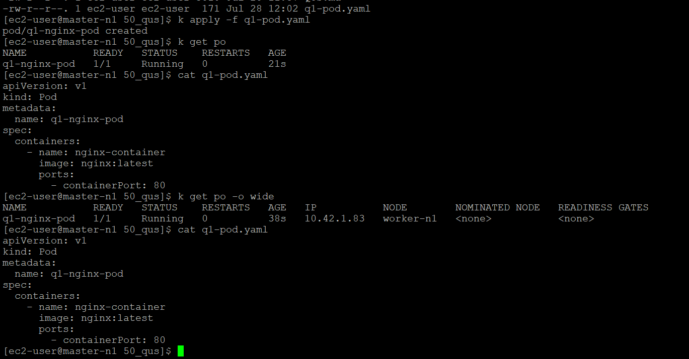

### qus : 1 | Create a basic pod using nginx image

```yaml
apiVersion: v1
kind: Pod
metadata:
  name: q1-nginx-pod
spec:
  containers:
    - name: nginx-container
      image: nginx:latest
      ports:
        - containerPort: 80
```



---

### Q2 : Expose that pod with a ClusterIP service

`vi q2-pod.yaml`:

```yaml
apiVersion: v1
kind: Pod
metadata:
  name: q2-nginx-pod
  label:
    app: nginx-q2-app
spec:
  containers:
    - name: nginx-container
      image: nginx:latest
      ports:
        - containerPort: 80
```

`vi q2-clusterip-svc.yaml`:

```yaml
apiVersion: v1
kind: Service
metadata:
  name: q2-nginx-service
spec:
  selector:
    app: nginx-q2-app
  ports:
    - protocol: TCP
      port: 80
      targetPort: 80
  type: ClusterIP
```

```sh
[ec2-user@master-n1 50_qus]$ kubectl get svc
NAME               TYPE        CLUSTER-IP     EXTERNAL-IP   PORT(S)   AGE
kubernetes         ClusterIP   10.43.0.1      <none>        443/TCP   16d
q2-nginx-service   ClusterIP   10.43.75.165   <none>        80/TCP    13m
[ec2-user@master-n1 50_qus]$ kubectl get po
NAME           READY   STATUS    RESTARTS   AGE
q2-nginx-pod   1/1     Running   0          15m
[ec2-user@master-n1 50_qus]$ kubectl run testbox --rm -it --image=busybox -- /bin/sh
If you don't see a command prompt, try pressing enter.
/ # wget -qO- q2-nginx-service
<!DOCTYPE html>
<html>
<head>
<title>Welcome to nginx!</title>
<style>
html { color-scheme: light dark; }
body { width: 35em; margin: 0 auto;
font-family: Tahoma, Verdana, Arial, sans-serif; }
</style>
</head>
<body>
<h1>Welcome to nginx!</h1>
<p>If you see this page, the nginx web server is successfully installed and
working. Further configuration is required.</p>

<p>For online documentation and support please refer to
<a href="http://nginx.org/">nginx.org</a>.<br/>
Commercial support is available at
<a href="http://nginx.com/">nginx.com</a>.</p>

<p><em>Thank you for using nginx.</em></p>
</body>
</html>
```

### 3. Create a Deployment with 3 replicas of nginx

`vi q3-deployment.yaml`

```yaml
apiVersion: apps/v1
kind: Deployment
metadata:
  name: q3-nginx-deployment
spec:
  replicas: 3
  selector:
    matchLabels:
      app: nginx-q3-app
  template:
    metadata:
      labels:
        app: nginx-q3-app
    spec:
      containers:
        - name: nginx-container
          image: nginx:latest
          ports:
            - containerPort: 80
```

> [!NOTE]
> Faced Error : for - apiVersion: v1
>
> ```
> [ec2-user@master-n1 50_qus]$ k apply -f q3-deployment.yaml
> error: resource mapping not found for name: "q3-nginx-deployment" namespace: "" from "q3-deployment.yaml": no matches for kind "Deployment" in version "v1"
> ensure CRDs are installed first
> ```
>
> Solution
> `kubectl explain deployment`
>
> ```sh
> GROUP:      apps
> KIND:       Deployment
> VERSION:    v1
> ```

```bash
[ec2-user@master-n1 50_qus]$ k get deployments/q3-nginx-deployment -o wide
NAME                  READY   UP-TO-DATE   AVAILABLE   AGE   CONTAINERS        IMAGES         SELECTOR
q3-nginx-deployment   3/3     3            3           47s   nginx-container   nginx:latest   app=nginx-q3-app
[ec2-user@master-n1 50_qus]$ k get deployments/q3-nginx-deployment
NAME                  READY   UP-TO-DATE   AVAILABLE   AGE
q3-nginx-deployment   3/3     3            3           54s
[ec2-user@master-n1 50_qus]$ k get po
NAME                                   READY   STATUS    RESTARTS   AGE
q3-nginx-deployment-6d6b7df55b-4b5rt   1/1     Running   0          61s
q3-nginx-deployment-6d6b7df55b-fg2t5   1/1     Running   0          61s
q3-nginx-deployment-6d6b7df55b-xdvpk   1/1     Running   0          61s
```

### 4. Scale the Deployment to 5 replicas

It can be done in two ways :

```bash
kubectl scale deployment q3-nginx-deployment --replicas=5
```

> O/P:
>
> ```sh
> [ec2-user@master-n1 50_qus]$ kubectl scale deployment q3-nginx-deployment --replicas=5
> deployment.apps/q3-nginx-deployment scaled
> [ec2-user@master-n1 50_qus]$ k get po
> NAME                                   READY   STATUS    RESTARTS   AGE
> q3-nginx-deployment-6d6b7df55b-4b5rt   1/1     Running   0          7m29s
> q3-nginx-deployment-6d6b7df55b-fg2t5   1/1     Running   0          7m29s
> q3-nginx-deployment-6d6b7df55b-pn5sg   1/1     Running   0          6s
> q3-nginx-deployment-6d6b7df55b-tcxzt   1/1     Running   0          6s
> q3-nginx-deployment-6d6b7df55b-xdvpk   1/1     Running   0          7m29s
>
> ```

or

```sh
kubectl edit deployment q3-nginx-deployment
```

> then edit the no of replica in the file and save

```sh
[ec2-user@master-n1 50_qus]$ kubectl edit deployment q3-nginx-deployment
deployment.apps/q3-nginx-deployment edited
[ec2-user@master-n1 50_qus]$ k get po
NAME                                   READY   STATUS    RESTARTS   AGE
q3-nginx-deployment-6d6b7df55b-4b5rt   1/1     Running   0          9m12s
q3-nginx-deployment-6d6b7df55b-fg2t5   1/1     Running   0          9m12s
q3-nginx-deployment-6d6b7df55b-pn5sg   1/1     Running   0          109s
q3-nginx-deployment-6d6b7df55b-xdvpk   1/1     Running   0          9m12s
```

### 5. Delete one pod from the Deployment and observe recreation

> **Observation**:
>
> Kubernetes automatically created a new pod to maintain the desired replica count set in the Deployment.
>
> **Why?**
>
> The Deployment controller ensures that the specified number of replicas is always running. When a pod is deleted, it automatically creates a new one to replace it.
>
> 🔁 **Self-healing** is a key feature of Kubernetes deployments.

```sh
[ec2-user@master-n1 50_qus]$ k delete po q3-nginx-deployment-6d6b7df55b-4b5rt & k get po -w \
>
[1] 21357
pod "q3-nginx-deployment-6d6b7df55b-4b5rt" deleted
NAME                                   READY   STATUS        RESTARTS   AGE
q3-nginx-deployment-6d6b7df55b-4b5rt   1/1     Terminating   0          14m
q3-nginx-deployment-6d6b7df55b-l4krv   0/1     Pending       0          0s
q3-nginx-deployment-6d6b7df55b-pn5sg   1/1     Running       0          6m55s
q3-nginx-deployment-6d6b7df55b-l4krv   0/1     Pending       0          0s
q3-nginx-deployment-6d6b7df55b-l4krv   0/1     ContainerCreating   0          0s
q3-nginx-deployment-6d6b7df55b-4b5rt   0/1     Completed           0          14m
q3-nginx-deployment-6d6b7df55b-4b5rt   0/1     Completed           0          14m
q3-nginx-deployment-6d6b7df55b-4b5rt   0/1     Completed           0          14m
q3-nginx-deployment-6d6b7df55b-l4krv   1/1     Running             0          3s
^C[1]+  Done                    kubectl delete po q3-nginx-deployment-6d6b7df55b-4b5rt
[ec2-user@master-n1 50_qus]$ k get po
NAME                                   READY   STATUS    RESTARTS   AGE
q3-nginx-deployment-6d6b7df55b-l4krv   1/1     Running   0          14s
q3-nginx-deployment-6d6b7df55b-pn5sg   1/1     Running   0          7m9s
```
